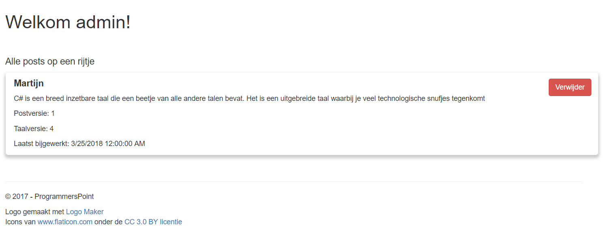
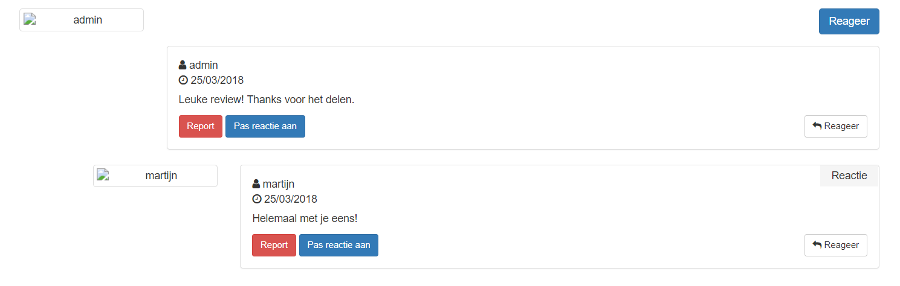
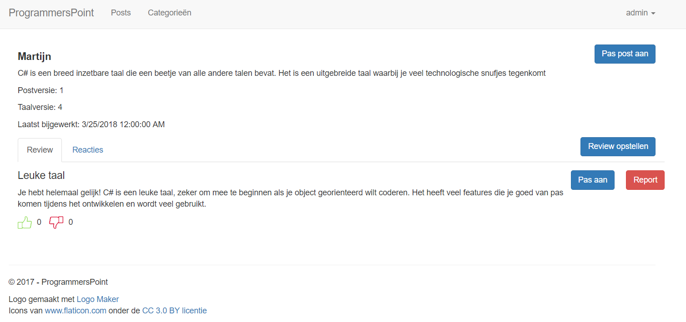
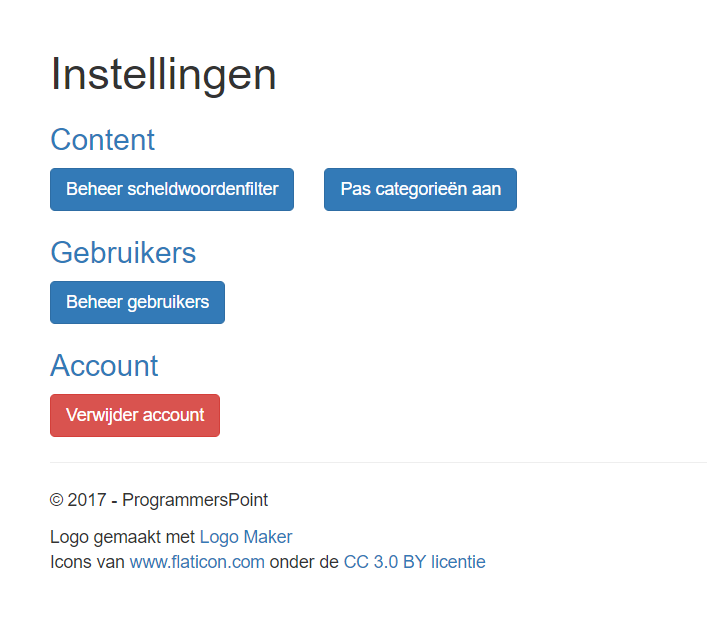

# ProgrammersPoint
## Summary
ProgrammersPoint is an application in which a user can find and share information about programming languages and techniques.  
Posts make up the base of ProgrammersPoint.
These posts are made by an admin and represent a central place of a particular language, structure etc underneath which users can post their reviews of the particular item. This is only possible if you registered for an account and are logged in.  
If that's the case, you'll also be able to react to other people's reviews and give the review a thumbs up or a thumbs down.  
That being said, having an account is **NOT** necessary! You'll always be able to look at the conversations/reviews of other people. You are not able to chime in and/or rate without a logged in account.  

ProgrammersPoint is built to be a safe place for everyone. In order to safeguard the enjoyment of the site, I implemented a curse word filter that picks up strong language in a user's writing and converts the vowels into star signs (*).

**In short:** ProgrammersPoint is a platform on which everyone can learn from eachother and contribute to a community of coders.

## Features  
Features are split up into several categories denoted by the following emojis:
:eyes: denotes a visual item / something uneditable  
:pencil2: denotes an action that changes the state of ProgrammersPoint in one way or another

ProgrammersPoint has the following features for a site visitor that's not logged in:
- :eyes: See all posts placed by the admins
- :eyes: Read corresponding reviews written by users of ProgrammersPoint
- :eyes: Read reactions to the particular topic
- :eyes: Check out the different categories created

As a logged in user you are able to:
- Do everything stated above
- :pencil2: Write a review on a particular post
- :pencil2: Write a reaction on a particular post
- :pencil2: Write a reaction to someone elses reaction (recursive reactions)
- :pencil2: Upvote and downvote reviews (only once per item, as it should be)
- :pencil2: Remove your account
- :pencil2: Report people for inappropriate language or behaviour
- :eyes: Receive a Chrome notification when a new post goes live
- :eyes: View a 'suggested feed' on the homepage after having read a certain amount of posts

If you have admin privileges you are able to:
- Do everything stated above
- :pencil2: Add posts
- :pencil2: Remove posts
- :eyes: Have insight into the user base and their privileges
- :pencil2: Change the privileges of a user
- :pencil2: Add to the curse word filter
- :pencil2: Remove words from the curse word filter
- :pencil2: Remove a category
- :pencil2: Add a category

## Gallery
**Home Screen**                           | **Home screen when logged in as admin**  
:----------------------------------------:|:----------------------------------------------------:
 |   

**Posts screen**                            | **Posts screen when logged in as admin**  
:------------------------------------------:|:------------------------------------------------------:
 |   

**Create Reaction Screen**                                 | **Reaction Chain**  
:---------------------------------------------------------:|:------------------------------------------------------------:
 |   

**Create Review Screen**                                   | **Review screen when logged in as admin**
:---------------------------------------------------------:|:----------------------------------------------------------:
 | 

**Settings Screen**                               | **User screen of settings when logged in as admin**
:------------------------------------------------:|:----------------------------------------------------------------:
 | 

## Running the application
You need to set up your own MSSQL database if you want to run ProgrammersPoint.  
This repo contains a folder called 'databasescripts' for you to be able to do this correctly.  
You'll find all of the scripts used for creating the final database used by the full application (it was iteratively build based on assignments in the FUN2 course).  
Executing all the scripts makes sure you've created all the necessary triggers, stored procedures and tables.  
In order to connect to your MSSQL database you can edit the 'connectieString' value in [src/ProgrammersPoint/Models/Database.cs](https://github.com/Martijnvos/ProgrammersPoint/blob/master/src/ProgrammersPoint/Models/Database.cs).

:warning: **Warning:** Dummy data is not provided. You should provide ProgrammersPoint with at least 1 user and 1 post for optimal usage.